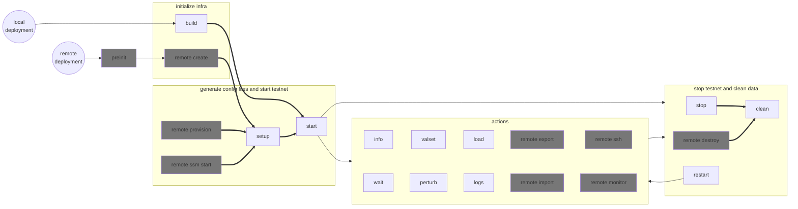
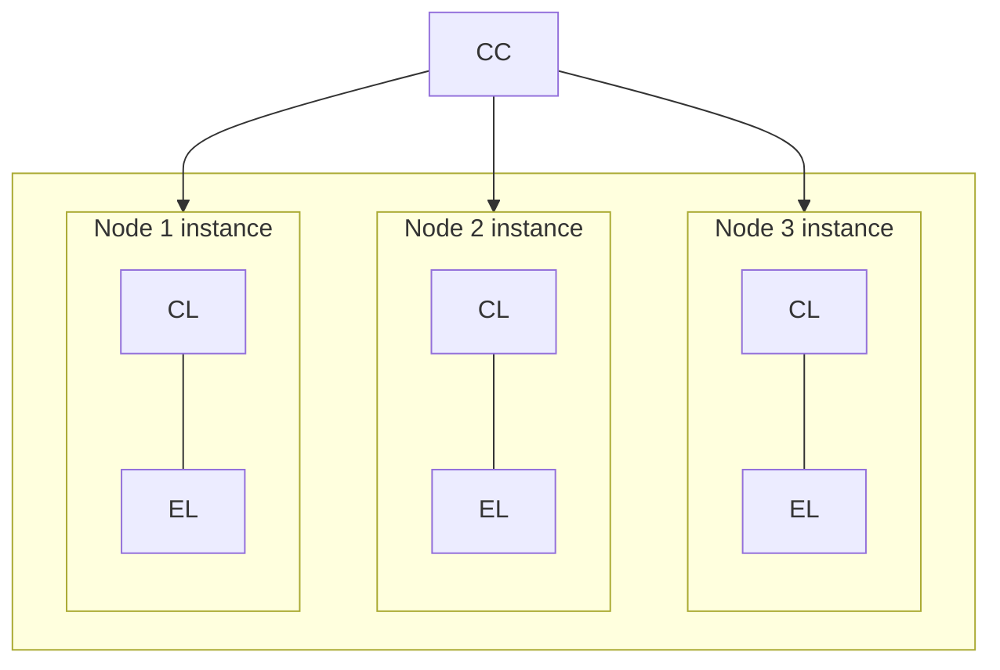
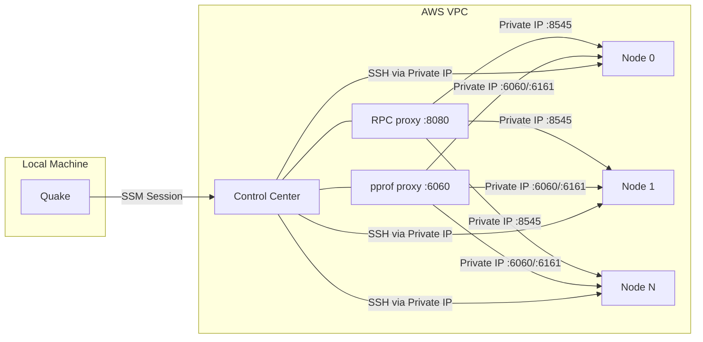

# Quake - End-to-end testing management tool

Quake is a tool for deploying Arc testnets and running end-to-end tests.

> **Quake testnets vs. the Arc Testnet:** Arc has a public, persistent
> [Testnet](https://docs.arc.network/arc/tutorials/deploy-on-arc) open to
> external developers and validators. Quake testnets are different: they are
> private, ephemeral networks spun up on demand for development and CI, then
> torn down when testing is complete. All mentions of "testnet" in this
> repository refer to Quake testnets unless explicitly stated otherwise.

#### Features
- Describe the testnet topology, node configurations, and test scenarios in TOML manifest files.
- CLI interface for deploying, managing, monitor testnets, and run tests on them.
- Deploy testnets locally in your machine or remotely in AWS infrastructure.
- Test the resilience of a running testnet:
  - perturb the nodes (disconnect, kill, pause, and restart them),
  - perform chaos testing (apply random perturbations, at random intervals, to random subsets of nodes or containers),
  - change the voting power of validators in the validator set of a node,
  - upgrade the running version of individual nodes.
- Emulate network latency between nodes by assigning data-center regions to nodes and injecting artificial latency between regions.
- MCP (Model Context Protocol) server for AI-assisted testnet management via Claude Code, Cursor, and other MCP-compatible clients.

__Table of contents__
- [Quake - End-to-end testing management tool](#quake---end-to-end-testing-management-tool)
      - [Features](#features)
  - [Usage](#usage)
    - [Quick start (local deployment)](#quick-start-local-deployment)
    - [Command workflow](#command-workflow)
    - [Basic commands](#basic-commands)
    - [The `load` and `spam` commands](#the-load-and-spam-commands)
    - [The `perturb` command](#the-perturb-command)
      - [Disconnect](#disconnect)
      - [Kill](#kill)
      - [Pause](#pause)
      - [Restart](#restart)
      - [Upgrade](#upgrade)
      - [Chaos testing](#chaos-testing)
    - [The `valset` command](#the-valset-command)
    - [The `mcp` command](#the-mcp-command)
    - [The `generate` command](#the-generate-command)
  - [Manifest File Format](#manifest-file-format)
    - [Basic Structure](#basic-structure)
    - [Nodes](#nodes)
    - [Node Configuration](#node-configuration)
    - [Execution Layer Configuration](#execution-layer-configuration)
      - [Configuration Syntax](#configuration-syntax)
      - [Default Flags](#default-flags)
      - [Reserved Flags](#reserved-flags-do-not-override)
      - [Examples](#examples)
    - [Voting Power](#voting-power)
    - [Node Groups and Persistent Peers](#node-groups-and-persistent-peers)
    - [Starting height](#starting-height)
    - [Subnets](#subnets)
    - [Latency emulation](#latency-emulation)
  - [Remote deployment](#remote-deployment)
    - [Communication via Control Center](#communication-via-control-center)
    - [Quick start](#quick-start)
    - [Instance sizing](#instance-sizing)
    - [Requirements](#requirements)
      - [GitHub token for pulling Docker images](#github-token-for-pulling-docker-images)
    - [Custom Docker images](#custom-docker-images)
    - [Remote commands](#remote-commands)
    - [Sharing a remote testnet](#sharing-a-remote-testnet)
  - [Profiling](#profiling)
    - [Prerequisites](#prerequisites)
    - [Feature environment variables](#feature-environment-variables)
    - [Building with profiling](#building-with-profiling)
    - [Available profiles](#available-profiles)
    - [Pulling profiles](#pulling-profiles)
      - [Remote testnets](#remote-testnets)
  - [Testing with Testnet](#testing-with-testnet)
    - [Running tests](#running-tests)
    - [Available test groups](#available-test-groups)
    - [Adding new tests](#adding-new-tests)

## Usage

Build Quake from the repository root directory:
```bash
cargo build -p quake
ln -s target/debug/quake quake # create a symbolic link to simplify calling the tool
```

### Quick start (local deployment)

Deploying and starting a local testnet is as simple as running `start`:
```sh
./quake -f crates/quake/scenarios/examples/10nodes.toml start
```
This will generate all necessary files to run the testnet and start running Arc in the nodes.

Now you can display comprehensive information about the testnet and check its status:
```sh
./quake info
```

The `start` command implicitly performs other commands (mainly `build` and `setup`), which we describe below.
Check out the [command workflow](#command-workflow) for a complete picture of all available commands.

Generate the files needed to start the testnet. If needed, you can manually
modify the generated configuration files before starting the nodes.
```bash
./quake -f crates/quake/scenarios/examples/10nodes.toml setup
```

> [!TIP]
> A command with the `-f` or `--file` option creates or updates a
> `.quake/.last_manifest` file containing the path to the most recently used
> manifest. This allows subsequent Quake commands to automatically reference the
> last manifest without requiring the `-f` flag.

```bash
# Build Docker images for the Consensus Layer (CL) and Execution Layer (EL)
./quake build

# Start the nodes. Implicitly calls setup.
./quake start

# Shows comprehensive information about the testnet's nodes.
./quake info

# Check the state of the testnet by displaying the latest heights of each node
./quake info heights -n 5

# Wait for the given nodes (or all nodes if unspecified) to reach height 100
./quake wait height 100 validator1 validator2

# Wait for execution clients to finish syncing
./quake wait sync

# Apply a pause for a random amount of time to the consensus layer containers of all validators
./quake perturb pause val*_cl

# Send 1000 transactions per second during 30 seconds to one validator node
./quake load -t 30 -r 1000 --targets validator1

# Mixed EIP-1559 and legacy transfer load (70/30 split)
./quake load -t 30 -r 1000 --mix transfer=70,legacy=30 --targets validator1

# Mixed ERC-20 and native transfer load (70/30 split)
./quake load -t 30 -r 1000 --mix transfer=70,erc20=30 --targets validator1

# ERC-20 with mixed functions: 60% transfer, 30% approve, 10% transferFrom
./quake load -t 30 -r 1000 --mix erc20=100 --erc20-fn-weights transfer=60,approve=30,transfer-from=10 --targets validator1

# Stop one node (both CL and EL containers)
./quake stop val*3

# Stop all the nodes and remove generated files
./quake clean

# Shorthand: clean and start the testnet in one step
./quake restart
```

### Command workflow

A bold arrow from command A to B means that calling B will automatically execute
A. For example, `./quake start` implicitly calls `setup` (if it finds that no
config files were generated) and `build` (if it finds no Docker images exist).



### Basic commands

Create the testnet files, including the node config files and genesis:
```bash
./quake -f crates/quake/scenarios/examples/10nodes.toml setup
```

This will create a directory `.quake/10nodes/` with:
- `compose.yaml`: Docker compose file with all the testnet containers.
- Node directories: Each node has its configuration files and a script for
  configuring latency emulation (if set in the manifest; see below). These
  directories also will store the Malachite app and Reth databases.
- `assets/`: Directory with files common to all nodes, such as `genesis.json` and
  `prometheus.yml`.
- `monitoring/`: Directory for config files and data of Prometheus and Grafana.

Build Docker images (as defined in the generated `.quake/10nodes/compose.yaml`):
```bash
./quake build
```

Start the nodes:
```bash
./quake start
```
It will run `setup`, if not done before.

Check out the logs of a node's CL or EL:
```
./quake logs validator1_cl
./quake tail validator1_el
```
Alternatively, the logs of all CL and EL containers are accessible in `.quake/<testnet_name>/logs/`.

Wait for the given nodes (or all nodes if unspecified) to reach height 100:
```bash
./quake wait height 100 validator1 validator2
```

Wait for execution clients to finish syncing (useful after node restarts or upgrades):
```bash
./quake wait sync validator1 validator2
```
The `sync` subcommand waits until `eth_syncing` returns `false` for all specified nodes.
You can customize the timeout and number of retries for transient RPC failures:
```bash
./quake wait sync --timeout 120 --max-retries 5
```

> [!TIP]
> When a command takes node or container names directly, we can use a
> wildcard `*`. For example, `val*_cl` expands to the names of all
> consensus-layer containers of validator nodes (`validator1_cl`,
> `validator2_cl`, etc.). This does not apply to `load` or `spam`
> `--targets`, which accept exact node names and manifest node groups.

Apply a pause of 300ms to the consensus layer containers of all validators:
```bash
./quake perturb pause val*_cl --time-off 300ms
```
If no time is specified, Quake will apply the perturbation for a random amount
of time. For more on perturbations, see below.

Send 1000 transactions per second during 30 seconds to one validator node:
```bash
./quake load -t 30 -r 1000 --targets validator1
```

Send a mixed workload (ERC-20 and native transfers) at 500 TPS:
```bash
./quake load -t 60 -r 500 --mix transfer=50,erc20=50 --targets validator1
```

Send ERC-20 traffic with diverse function calls (approve, transferFrom alongside transfer):
```bash
./quake load -t 60 -r 500 --mix erc20=100 --erc20-fn-weights transfer=60,approve=30,transfer-from=10 --targets validator1
```

Stop the nodes
```bash
./quake stop
```

Remove generated files
```bash
./quake clean
```
It will `stop` the nodes, if not done before.

Clean and restart the testnet in one step:
```bash
./quake restart
```
This is equivalent to running `clean` followed by `start`. It accepts the same
flags as both commands, e.g. `--all` (from `clean`) and `--remote` (from `start`):
```bash
# Clean everything (including monitoring data) and restart
./quake restart --all

# Clean all nodes and restart specific nodes
./quake restart validator1 validator2
```
If you want to restart just some nodes leaving the others running, use `quake perturb restart <nodes>`.

### The `load` and `spam` commands

Both commands send transaction load to a running testnet using the [spammer](../spammer/README.md).
Transactions are dispatched over WebSocket JSON-RPC. They
accept the same flags as the spammer and differ only in the adopted send mode:

| Command | Send mode | Nonce handling | Error recovery | Best for |
|---------|-----------|---------------|----------------|----------|
| `load` | Backpressure | Advances only on acceptance | Re-queries nonce on rejection, skips after 3 consecutive failures | Correctness-sensitive workloads, reproducible tests |
| `spam` | Fire-and-forget | Incremented optimistically | None (transactions may be lost) | Peak-throughput stress tests |

**Backpressure mode** (`load`) waits for each JSON-RPC response for a transaction before submitting
the next one. If a transaction is rejected the sender re-queries the
node for the correct nonce and retries. This is slower but guarantees that every
submitted transaction has a valid nonce and is accepted by RPC endpoint.

**Fire-and-forget mode** (`spam`) pushes transactions into a 10,000-item
buffered channel and dispatches them without waiting for responses. Nonces are
incremented at generation time, so nonce gaps can occur when transactions are
rejected. Use `--wait-response` (`-w`) to optionally wait for each response
while still using optimistic nonces; expect multiple `nonce too low` errors to be produced.

Both commands support blending transaction types with `--mix`:
```bash
# 1000 TPS of native transfers for 30 seconds (backpressure)
./quake load -t 30 -r 1000 --targets validator1

# Same workload in fire-and-forget mode
./quake spam -t 30 -r 1000 --targets validator1

# Mixed workload: 70% native transfers, 30% ERC-20
./quake load -t 60 -r 500 --mix transfer=70,erc20=30 --targets validator1

# Gas-intensive workload with diverse guzzler functions
./quake load -t 60 -r 200 --mix guzzler=100 \
  --guzzler-fn-weights hash-loop=70@2000,storage-write=30@600 \
  --targets validator1

# Fire-and-forget at high throughput, targeting all nodes
./quake spam -t 120 -r 5000
```

`--targets` accepts a comma-separated list of explicit node names or manifest
node groups such as `ALL_VALIDATORS`, `ALL_NON_VALIDATORS`, `ALL_NODES`, or
custom groups defined under `[node_groups]`. If `--targets` is omitted,
transactions are sent to all manifest nodes.

Common flags (see `./quake load --help` for the full list):

| Flag | Short | Default | Description |
|------|-------|---------|-------------|
| `--rate` | `-r` | `1000` | Target TPS across all generators |
| `--time` | `-t` | `0` | Max duration in seconds (0 = unlimited) |
| `--num-txs` | `-n` | `0` | Max total transactions (0 = unlimited) |
| `--num-generators` | `-g` | `1` | Parallel generators, each with its own account slice |
| `--mix` | | `transfer=100` | Transaction type blend: `transfer`, `erc20`, `guzzler` |
| `--tx-latency` | | `false` | Record submit-to-finalized latency to CSV |

#### Latency tracking (`--tx-latency`)

The `--tx-latency` flag measures end-to-end transaction latency: the wall-clock
time between `eth_sendRawTransaction` submission and finalized block inclusion.
See the [spammer README](../spammer/README.md#transaction-latency-tracking) for
full details on the tracking architecture, CSV output format, and analysis tools.

```bash
./quake load -t 30 -r 1000 --tx-latency --targets validator1
./quake load -t 30 -r 1000 --tx-latency --csv-dir .quake/results --targets validator1
```

**Recording behavior by mode:**

- **Backpressure** (`load`): only transactions accepted by the node are tracked.
  Rejected and transient errors are skipped.
- **Fire-and-forget with `--wait-response`** (`spam -w`): same, only accepted
  transactions.
- **Fire-and-forget without `--wait-response`** (`spam`): all dispatched
  transactions are tracked, including those later rejected by the node. These
  unmatched entries remain in memory and are evicted after 5 minutes without
  appearing in the CSV.

Transactions that are never included in a block (dropped from mempool, rejected
after submission) do not appear in the CSV.

### The `perturb` command
Quake offers a number of perturbations that can be applied to nodes in the testnet.
These are available as subcommands of the `perturb` command:
- `disconnect`: Disconnect the node from the network
- `kill`: Kill the node using `SIGKILL`, wait for a given amount of time, and restart it
- `pause`: Pause the node, wait for a given amount of time, and unpause it
- `restart`: Restart the node
- `upgrade`: Upgrade the consensus and/or execution layer of a node to newer Docker image (will stop the node to do so).
- `chaos`: Apply random perturbations, at random intervals, to a list of nodes or containers.

All perturbations accept a single node, a list of nodes, a single container, or a
list of containers as arguments:
- With "node" we refer to the logical node as defined in the manifest. For example,
    with these manifest files:

    ```toml
    [[nodes]]
    [validator1]
    [validator2]
    ```
    or
    ```toml
    [nodes.validator1]
    [nodes.validator2]
    ```
    you should pass `validator1` or `validator2` as arguments to the `perturb` command.
    Passing the node name will apply the perturbation to both the consensus layer (CL)
    and execution layer (EL) containers of the node.
- With "container" we refer to the actual docker container running in the testnet. For
    example, if you have a node named `validator1`, it will have two containers named
    `validator1_cl` and `validator1_el`. You can pass either of these container names
    as arguments to the `perturb` command to apply the perturbation to a specific
    container.
- You can also use wildcards to match multiple nodes or containers. For
    example, `val*` will match all nodes starting with `val`, and `val*_cl` will match
    all consensus layer containers.

We'll go a bit deeper into each perturbation in the following sections.

#### Disconnect
The `disconnect` perturbation disconnects one or more nodes/containers from the
network defined in the docker compose file, waits for a given, configurable amount of
time, and reconnects them to the network.
By default, the disconnect time is a random value between 250ms and 10s.
Note that the command will return an error if the disconnect time is less than 250ms,
or greater than 10s.

Usage examples:
```
# Disconnect a single node (both CL and EL containers) for a random amount of time
quake perturb disconnect validator1

# Disconnect multiple nodes (both CL and EL containers) for 500ms
quake perturb disconnect validator1 validator2 --time-off 500ms

# Disconnect a single consensus container for 3 seconds
quake perturb disconnect validator1_cl -t 3s

# Disconnect multiple execution containers for a random amount of time
quake perturb disconnect val*_el
```

#### Kill
The `kill` perturbation kills one or more nodes/containers using `SIGKILL` (i.e.,
ungraceful shutdown), waits for a given, configurable amount of time, and restarts them.
By default, the time it waits before restarting them is a random value between 250ms and 10s.
Note that the command will return an error if the wait time is less than 250ms,
or greater than 10s.

Usage examples:
```
# Kill a single node (both CL and EL containers) for a random amount of time
quake perturb kill validator1

# Kill multiple nodes (both CL and EL containers) for 500ms
quake perturb kill validator1 validator2 --time-off 500ms

# Kill a single consensus container for 3 seconds
quake perturb kill validator1_cl -t 3s

# Kill multiple execution containers for a random amount of time
quake perturb kill val*_el
```

#### Pause
The `pause` perturbation pauses one or more nodes/containers, waits for a given,
configurable amount of time, and resumes them.
By default, the time it waits before resuming them is a random value between 250ms
and 10s.
Note that the command will return an error if the pause time is less than 250ms,
or greater than 10s.

Usage examples:
```
# Pause a single node (both CL and EL containers) for a random amount of time
quake perturb pause validator1

# Pause multiple nodes (both CL and EL containers) for 500ms
quake perturb pause validator1 validator2 -t 500ms

# Pause a single consensus container for 3 seconds
quake perturb pause validator1_cl --time-off 3s

# Pause multiple execution containers for a random amount of time
quake perturb pause val*_el
```

#### Restart
The `restart` perturbation restarts one or more nodes/containers.
The node/containers are gracefully stopped before restarting them, unlike the `kill`
perturbation, which uses `SIGKILL`.
Note that this command does not accept a time argument, since the restart is immediate.

Usage examples:
```
# Restart a single node (both CL and EL containers)
quake perturb restart validator1

# Restart multiple nodes (both CL and EL containers)
quake perturb restart validator1 validator2

# Restart a single consensus container
quake perturb restart validator1_cl

# Restart multiple execution containers
quake perturb restart val*_el
```

#### Upgrade
The `upgrade` perturbation upgrades one or more nodes/containers to a new Docker image.
The node/containers are gracefully stopped before upgrading them, and then restarted
with the new image.
Note that this command does not accept a time argument, since the upgrade is immediate.

You must declare the new image name and tag in the manifest file before running
this command, otherwise it will fail. For example:
```toml
image_cl="arc_consensus:current"     # Starting image for CL containers
image_el="arc_execution:current"     # Starting image for EL containers
image_cl_upgrade="arc_consensus:new" # Upgrade image for CL containers
image_el_upgrade="arc_execution:new" # Upgrade image for EL containers

[[nodes]]
... node definitions ...
```
The `image_cl` and `image_el` fields are optional and specify which Docker image
to use when starting the testnet. If not specified, the default images
from the deployment YAML files will be used (namely, `arc_consensus:latest` and
`arc_execution:latest`).

The `image_cl_upgrade` and `image_el_upgrade` fields specify which Docker image
to use when upgrading nodes with the `upgrade` command.

These are global settings that apply to all nodes, so you only need to declare them
once. At the moment we don't support per-node tags.

Usage examples:
```
# Upgrade a single node (both CL and EL containers)
quake perturb upgrade validator1

# Upgrade multiple nodes (both CL and EL containers)
quake perturb upgrade validator1 validator2
```

**Important Note**: The `upgrade` command is a one-time operation.
You should run it only once per node.


#### Chaos testing

The `perturb chaos` sub-command applies random perturbations on a running testnet.

For example, the following command will run chaos testing for 30 minutes, randomly killing, pausing, or restarting up to a third of the targeted containers, waiting between 5 s and 20 s between actions, and keeping affected containers offline for at most 1 minute.
```
./quake perturb --max-time-off 1m chaos --time 30m --min-wait 5s --max-wait 20s --perturbations kill,pause,restart
```

### The `valset` command
This command updates the voting power of one or more validators.
Under the hood, each validator sends a transaction to its local reth instance's
validator manager smart contract via RPC (the `updateValidatorVotingPower` call).

Because each validator performs this update independently, the changes are not
atomic and it may take several heights for the changes to take effect.

Example run:
```bash
quake valset validator1:30 validator2:0
```
Setting a validator's voting power to 0 will remove it from the validator set, while
keeping its controller account.

Notes:
- the command accepts only node names (`validator1`, `validator2`, etc.), that is,
do not use container names (`validator1_cl`, `validator2_cl`).
- it does not accept `*` wildcards.

### The `mcp` command

The `mcp` command starts a [Model Context Protocol](https://modelcontextprotocol.io/) (MCP) server that exposes Quake's testnet tools to AI assistants like Claude Code, Cursor, and other MCP-compatible clients. This lets you observe, manage, and test a running testnet through natural language.

The server automatically discovers the most recently used testnet via `.quake/.last_manifest`, so there's no need to specify a manifest path.

#### Quick setup

1. Start a testnet as usual:
   ```bash
   ./quake -f crates/quake/scenarios/examples/10nodes.toml start
   ```

2. Start Claude Code or your preferred MCP client (or restart it if it was already running).
   It will read `.mcp.json` and automatically spawn `quake mcp` as a subprocess using stdio transport.

3. Interact with the testnet:
   ```
   > What's the current status of the testnet?
   > Pause validator3 for 5 seconds
   > Run the probe tests
   ```

#### Transport modes

The MCP server supports two transport modes:

- **stdio** (default): The server communicates over stdin/stdout. This is the standard mode used by Claude Code, Cursor, and similar clients that spawn the server as a subprocess.
  ```bash
  quake mcp
  ```

- **HTTP+SSE** (`--http`): The server listens on a network port for remote MCP clients. Useful when the testnet is running on a remote machine.
  ```bash
  quake mcp --http --port 8080
  ```

#### Available tools

The MCP server exposes 20 tools organized into five categories:

- **Observability** (read-only): `testnet_status`, `list_nodes`, `get_block_heights`, `get_mempool`, `get_peers`
- **Lifecycle**: `start_nodes`, `stop_nodes`, `restart_testnet`, `clean_testnet`
- **Perturbations**: `perturb_disconnect`, `perturb_kill`, `perturb_pause`, `perturb_restart`, `perturb_upgrade`
- **Testing**: `run_tests`, `wait_height`, `valset_update`
- **Remote** (remote testnets only): `remote_ssh`, `remote_ssm`, `remote_provision`

#### Resources

The server also exposes two MCP resources:

| URI | Description |
|-----|-------------|
| `quake://manifest` | The current testnet manifest (TOML configuration file) |
| `quake://nodes` | All node metadata as JSON |


### The `generate` command

The `generate` command (alias `gen`) creates random manifest files for testing. It is useful for nightly or ad‑hoc runs that exercise many topologies and configurations without writing manifests by hand.

**Behavior**

- Writes one or more TOML manifests into the given output directory.
- For certain **combinations** of topology, height strategy, and region strategy, it generates `count` manifests (each with a different seed).
- **Seeding:** If you pass `--seed S` (before the `generate` command), that value is used as the base seed. The first manifest gets seed `S`, the next gets `S+1`, then `S+2`, and so on. This makes runs reproducible: the same `--seed` and options produce the same manifests. Without `--seed`, the base seed is chosen at random (different each run), so output varies between invocations.
  - Example: `quake --seed 42 gen -o out -c 2` produces `2 x 9 combinations = 18 manifests` with seeds `42`, `43`, `44`, ... , `59`; running again with the same arguments yields identical manifests.

**Randomization strategies**

| Dimension | Options |
|-----------|--------|
| **Network topology** | 1 node \| 5 nodes \| complex |
| **Height start** | All nodes at 0 \| some nodes start at 100 |
| **Region assignment** | Single region \| uniform random \| clustered |

The **complex** topology creates a sentry architecture with the following structure:
- **Sentry group 1**: 1–3 validators (randomly chosen per manifest), fully meshed with each other and connected to `sentry-1`
- **Sentry group 2**: 1–3 validators (randomly chosen per manifest), fully meshed with each other and connected to `sentry-2`
- **Sentries**: `sentry-1` and `sentry-2` are connected to each other, to their respective validator groups, and to the `relayer`
- **Relayer**: Connected to both sentries and to 1 full node
- **Full node**: `full-1` is connected to the `relayer`

All connections use persistent peers, creating a structured network topology that isolates validators behind sentry nodes.

For each combination, it generates `count` manifests (default 1). The combinations are:
- 1 combination with single node (no region or height strategy variation)
- 6 combinations with 5 nodes (2 height strategies × 3 region strategies)
- 2 combinations with complex topology (2 height strategies, all nodes within a single region)

Total manifests generated = 9 × `count`.


**Randomized per manifest**

- Consensus Layer: logging, p2p transport (tcp/quic), value_sync parameters, runtime flavor, pruning, and related options.
- Execution Layer: txpool, builder, and engine options (within safe ranges).
- Manifest-level: engine API connection (IPC vs RPC), initial hardfork (e.g. zero6/zero5).

Consensus, value_sync, and RPC are always enabled so that `setup` → `start` → `wait height` → `test` works on every generated manifest.

**Options**

| Option | Short | Default | Description |
|--------|-------|---------|-------------|
| `--output-dir` | `-o` | `.quake/generated` | Directory to write manifest files into. |
| `--count` | `-c` | `1` | Number of manifests to generate **per combination**. |
| `--seed` | — | *(random)* | Base seed for the RNG (use for reproducible runs). |

**Examples**

```bash
# Generate 1 manifest per combination (9 total) with a fixed seed
quake --seed 42 generate --output-dir target/manifests

# Generate 10 manifests per combination (90 total), reproducible
quake --seed 123 generate -o target/manifests -c 10

# Generate 1 per combination with a random seed (different each run)
quake generate -o target/manifests
```

**Nightly CI**

A [nightly workflow](../../.github/workflows/nightly-random-manifests.yml) runs daily at 3 AM UTC and can be triggered:
- **Scheduled/PR runs**: Use seed `42` for reproducibility.
- **Manual dispatch** (`workflow_dispatch`): Optionally specify a base seed (must be a non-negative integer; leave blank to use `42`) and a per-job count (positive integer ≤ 50; leave blank to use `3`).

The workflow runs **10 parallel jobs** (matrix indices 0–9). Each job computes its effective seed as `BASE_SEED + 10000 × index`, then calls `quake --seed <SEED> generate --count <COUNT>` to produce `COUNT × 9` manifests (default: `3 × 9 = 27` per job, `270` total across all jobs). Each job then runs the full test pipeline on every manifest: `setup` → `start` → `wait height 140` → `test` → `clean`. Logs and reports are uploaded to the artifacts bucket with per-job artifact names (`-idx<N>`). The driving script is [`scripts/scenarios/nightly-random-manifests.sh`](../../scripts/scenarios/nightly-random-manifests.sh).

PRs labeled `test-random` will also trigger this workflow.

### The `clean` command

By default, `clean` removes all node data and configuration. The following flags control what is removed:

| Flag | Short | Description |
|------|-------|-------------|
| `--all` | `-a` | Remove everything, including monitoring services and their data. Cannot be combined with other flags. |
| `--monitoring` | `-m` | Stop monitoring services and remove their data only. |
| `--data` | `-d` | Remove only execution and consensus layer data, preserving configuration. Cannot be combined with `--execution-data` or `--consensus-data`. |
| `--execution-data` | `-x` | Remove only execution layer (Reth) data. Cannot be combined with `--data` or `--consensus-data`. |
| `--consensus-data` | `-c` | Remove only consensus layer (Malachite) data. Cannot be combined with `--data` or `--execution-data`. |

```bash
# Remove node data only (keep config, monitoring intact)
./quake clean --data

# Remove only execution layer data
./quake clean --execution-data

# Remove only consensus layer data
./quake clean --consensus-data

# Remove node data and monitoring
./quake clean --data --monitoring

# Remove everything including monitoring
./quake clean --all
```

## Manifest File Format

The manifest is a TOML file.

Before parsing, all `${VAR_NAME}` patterns are
replaced with values from the process environment and `.env` files. This allows
any field to reference environment variables. For example:
```toml
image_cl="${IMAGE_REGISTRY_URL}/arc-consensus:abc123"
```

### Basic Structure

Optional top-level settings:
- **name**: Name of the test scenario
- **description**: Description of the test scenario
- **engine_api_connection**: Connection method between Consensus Layer (CL) and Execution Layer (EL). Valid values: "ipc" (default), "rpc".
- **image_cl** and **image_el**: Docker images for CL and EL containers. If omitted, defaults to
  - for local mode: `arc_consensus:latest` and `arc_execution:latest`, or
  - for remote mode: `${IMAGE_REGISTRY_URL}/arc-consensus:<version>` and
    `${IMAGE_REGISTRY_URL}/arc-execution:<version>`, where `IMAGE_REGISTRY_URL`
    is taken from the `.env` file (see [Custom Docker images](#custom-docker-images)).
- **image_cl_upgrade**, **image_el_upgrade**: Docker images to use when upgrading containers with `quake perturb upgrade`. Required for upgrade scenarios; not supported in remote mode.

### Nodes

Nodes are defined as individual TOML sections with names starting with `validator` or `node`.
```toml
[[nodes]]
[validator1]
[validator2]
[node1]
[node2]
```

### Node Configuration

Consensus Layer (CL) configuration is set under `cl.config.*` keys. The
schema depends on the CL image version (`image_cl`):

- **Modern CL (>= v0.5.0)**: the schema matches the `StartCmd` struct in
  [`crates/malachite-cli/src/cmd/start.rs`](../malachite-cli/src/cmd/start.rs).
  Keys are flat and map 1:1 to the `arc-node-consensus start` CLI flags
  (e.g. `cl.config.log_level = "debug"` → `--log-level=debug`). Quake
  translates the merged config into CLI flags at setup time and the node is
  launched with no `config.toml`.
- **Legacy CL (< v0.5.0)**: the schema matches the `Config` struct in
  [`crates/types/src/config.rs`](../types/src/config.rs). Keys are nested
  (e.g. `cl.config.logging.log_level = "debug"`) and the merged config is
  written to `config.toml` at setup time. Legacy mode is scheduled for
  deprecation.

Quake detects which schema to use by parsing the `image_cl` tag; `latest`,
missing tags, and unparseable tags are treated as Modern. The two formats
are not interchangeable — `cl.config.log_level` on a Legacy image (and
`cl.config.logging.log_level` on a Modern image) will fail to parse.
Upgrading a running testnet across the legacy/modern boundary with
`perturb upgrade` is **not supported**: the upgraded binary would start
with no CLI flags. For upgrade scenarios, start the testnet on a Modern
version.

The default configuration of Reth (Execution Layer) is defined in
[`crates/quake/src/manifest.rs`](src/manifest.rs). It can be set globally
or for each node by prefixing the config field with `el.config.`.

For example (Modern CL):

```toml
# Global settings that apply to all nodes
engine_api_connection = "rpc"  # or "ipc" (default)
cl.config.log_level = "debug"
el.config.disable-discovery = true

[[nodes]]
[validator1]
# Node-specific settings
cl.config.discovery_num_outbound_peers = 30
[validator2]
# Node-specific settings
el.config.builder.deadline = 5
[node1]
[node2]
```

In general, node configuration options are applied with the following precedence, from
lowest to highest priority:

1. **Global manifest configs**: defined at the top level of your manifest file
3. **Per-node manifest configs**: defined within each node's section

Higher-priority configs override lower-priority ones when their keys match.

#### Execution Layer Configuration
In addition to the general node configuration described above, the EL configuration
adds another layer of defaults defined in `crates/quake/src/manifest.rs`.
This means that Quake manages Reth (Execution Layer) flags through a three-tier
configuration system. Configs are applied with the following precedence, from
lowest to highest priority:

1. **Default configs**: defined in `crates/quake/src/manifest.rs`
2. **Global manifest configs**: defined at the top level of your manifest file
3. **Per-node manifest configs**: defined within each node's section

As before, higher-priority configs override lower-priority ones when their keys match.
For a full list of reth CLI flags that you can set in your manifest, see the
[Reth documentation](https://reth.rs/cli/op-reth/node).

##### Configuration Syntax

EL configs use TOML table syntax under the `el.config` key.
Boolean flags (like `--http` or `--disable-discovery`) use `true`/`false`,
while flags with values use their appropriate types (strings, integers, arrays).

```toml
# Global EL config that applies to all nodes
[el.config]
http.enable = true
http.api = ["admin", "net", "eth"]
engine.persistence-threshold = 5
disable-discovery = true

[nodes.validator1]
# Per-node config that overrides global and defaults for this node only
el.config.engine.persistence-threshold = 10
el.config.builder.deadline = 5

[nodes.validator2]
# No per-node config, so it inherits global + defaults

[nodes.full1]
# Per-node config can also use table syntax
[nodes.full1.el.config]
txpool.nolocals = false
```

**Special syntax notes:**
- `http.enable = true` produces `--http` (the `.enable` suffix is stripped)
- `ws.enable = true` produces `--ws`
- `disable-discovery = true` produces `--disable-discovery`
- `disable-discovery = false` omits the flag entirely
- Array values like `http.api = ["admin", "net"]` produce `--http.api=admin,net`
- Array values are **replaced**, not merged. If a node defines `http.api = ["admin"]`,
  it completely overrides the default array, not appends to it.
- Quake does not validate flag names. Misspelled flags (e.g., `htpp.port = 8545`)
  will be passed to Reth, which will fail at startup with an unrecognized flag error.

#### Default Flags

The following flags are applied to all nodes by default. They are defined in
`crates/quake/src/manifest.rs` and can be overridden in your manifest:

| Flag | Default Value | Description |
|------|---------------|-------------|
| `http.enable` | `true` | Enable the HTTP-RPC server |
| `http.api` | `["admin", "net", "eth", "web3", "debug", "txpool", "trace", "reth"]` | APIs exposed over HTTP |
| `ws.enable` | `true` | Enable the WebSocket-RPC server |
| `ws.api` | `["admin", "net", "eth", "web3", "debug", "txpool", "trace", "reth"]` | APIs exposed over WebSocket |
| `engine.persistence-threshold` | `0` | Persistence threshold for engine payloads |
| `engine.memory-block-buffer-target` | `0` | Memory block buffer target |
| `enable-arc-rpc` | `true` | Enable Arc-specific RPC methods |
| `rpc.txfeecap` | `1000` | Maximum transaction fee cap |
| `txpool.nolocals` | `true` | Treat all transactions equally (no local priority) |

To override a default, simply define the flag in your manifest's global or
per-node `el.config` section.

#### Reserved Flags (Do Not Override)

The following flags are managed by Docker Compose templates and **must not be
set in manifests**. If present, they are silently ignored:

| Flag | Value (Local) | Value (Remote) | Notes |
|------|---------------|----------------|-------|
| `datadir` | `/data/reth/execution-data` | `/data/reth/execution-data` | Data directory path |
| `chain` | `/app/assets/genesis.json` | `/app/assets/genesis.json` | Genesis file path |
| `http.port` | `8545` | `8545` | HTTP-RPC port |
| `http.addr` | `0.0.0.0` | `0.0.0.0` | HTTP-RPC bind address |
| `http.corsdomain` | `*` | `*` | CORS allowed origins |
| `ws.port` | `8546` | `8546` | WebSocket-RPC port |
| `ws.addr` | `0.0.0.0` | `0.0.0.0` | WebSocket-RPC bind address |
| `ws.origins` | `*` | `*` | WebSocket allowed origins |
| `metrics` | `0.0.0.0:9001` | `0.0.0.0:9001` | Metrics endpoint |
| `authrpc.addr` | `0.0.0.0` | `0.0.0.0` | Auth server address to listen on (RPC mode) |
| `authrpc.port` | `8551` | `8551` | Auth server port to listen on (RPC mode) |
| `authrpc.jwtsecret` | `/app/assets/jwtsecret` | `/assets/jwtsecret` | JWT secret path (RPC mode) |
| `ipcdisable` | (set) | (set) | Disable IPC (RPC mode only) |
| `ipcpath` | `/sockets/reth.ipc` | `/sockets/reth.ipc` | IPC socket path (IPC mode) |
| `auth-ipc` | (set) | (set) | Enable authenticated IPC (IPC mode) |
| `auth-ipc.path` | `/sockets/auth.ipc` | `/sockets/auth.ipc` | Auth IPC socket path (IPC mode) |
| `p2p-secret-key` | `/data/reth/execution-data/nodekey` | `/data/reth/execution-data/nodekey` | Pre-generated secp256k1 key for P2P identity |
| `trusted-peers` | *(auto-generated)* | *(auto-generated)* | Comma-separated enode URLs of all other nodes |

The IPC vs RPC flags are automatically selected based on the connection mode.
Use `quake setup --rpc` to switch from IPC (default) to RPC connections between
the Consensus Layer and Execution Layer. You can also set this in your manifest using
the `engine_api_connection` top-level key.

#### Examples

**Example 1: Override a default flag globally**

```toml
# Disable the txpool.nolocals default for all nodes
[el.config]
txpool.nolocals = false

[nodes.validator1]
[nodes.validator2]
```

**Example 2: Per-node override**

```toml
[nodes.validator1]
# This node uses a custom persistence threshold
el.config.engine.persistence-threshold = 10
el.config.builder.deadline = 5

[nodes.validator2]
# Uses defaults only
```

**Example 3: Mixed global and per-node configuration**

```toml
# Global: disable discovery for all nodes
[el.config]
disable-discovery = true
engine.persistence-threshold = 5

[nodes.validator1]
# Override: re-enable discovery for this node
el.config.disable-discovery = false

[nodes.validator2]
# Uses global config (discovery disabled, threshold=5)

[nodes.full1]
# Override: different persistence threshold
el.config.engine.persistence-threshold = 20
```

> [!NOTE]
> When you set `enable-arc-rpc = true` (the default), `--arc-rpc-upstream-url=<URL>`
> is automatically added to Reth's configuration. You don't need to include it
> manually.

### Voting Power

By default every validator in genesis receives a voting power of 20. To override this, set `cl_voting_power` on each validator node:

```toml
[nodes.validator-1]
cl_voting_power = 2000

[nodes.validator-2]
cl_voting_power = 2000

[nodes.validator-3]
cl_voting_power = 1000

[nodes.full1]
```

If `cl_voting_power` is specified for any validator, it must be specified for all validators (all-or-nothing). This prevents accidental power imbalances where one validator silently defaults to 20 while others are set to much higher values. Non-validator nodes ignore this field.

### Node Groups and Persistent Peers

> **Note:** The `cl_persistent_peers` setting described below applies to the **Consensus Layer** (Malachite) P2P connections. **Execution Layer** (Reth) P2P: during setup, a secp256k1 nodekey is pre-generated for each node. Reth's `--trusted-peers` is built from each node's `el.config.trusted_peers` when set (same format as `cl_persistent_peers`: node names or group names, resolved to enodes); when `el.config.trusted_peers` is not set for a node, that node gets a full mesh of all other nodes.

You can define custom groups of nodes and use them to configure peer connections. This is useful for setting up network topologies where certain nodes should only connect to specific subsets of other nodes.

**Pre-defined node groups:**
- `ALL_NODES` - All nodes in the manifest
- `ALL_VALIDATORS` - All validator nodes, that is, nodes with names starting with `val` (e.g., `validator1`, `val2`)
- `ALL_NON_VALIDATORS` - All nodes that are not validators

These names are reserved built-ins and cannot be redefined under
`[node_groups]`.

**Custom node groups** are defined in the `[node_groups]` section. Groups can reference individual node names, pre-defined groups, or other groups previously declared:

```toml
[node_groups]
FULL_NODES = ["full1", "full2"]
TRUSTED = ["ALL_VALIDATORS", "FULL_NODES", "other_node"]

[nodes.validator1]
cl_persistent_peers = ["TRUSTED"]
[nodes.validator2]
[nodes.validator3]
[nodes.validator4]
[nodes.full1]
cl_persistent_peers = ["ALL_NON_VALIDATORS"]
[nodes.full2]
cl_persistent_peers = ["ALL_VALIDATORS"]
[nodes.sentry]
cl_persistent_peers = ["ALL_NODES"]
[nodes.other_node]
```

In this example:
- `FULL_NODES` is a custom group containing `full1` and `full2`
- `TRUSTED` combines the `ALL_VALIDATORS` group, the `FULL_NODES` group, and the individual node `other_node`
- `validator1` will have persistent peers: `validator2`, `validator3`, `validator4`, `full1`, `full2`, `other_node` (the `TRUSTED` group, excluding itself)
- `full1` will connect to all non-validators: `full2`, `sentry`, `other_node`
- `sentry` will connect to all nodes except itself

The same group names can also be used as `quake load` and `quake spam`
targets. For example:

```bash
./quake load -t 60 -r 500 --targets ALL_VALIDATORS
./quake spam -t 30 -r 1000 --targets TRUSTED
./quake remote load -- --targets FULL_NODES -r 1000 -t 60
```

To distinguish group references from individual nodes in peer lists, by convention we use lowercase for node names and uppercase for node group names.

Note: A node is automatically excluded from its own persistent peers list.

**Default behavior for `cl_persistent_peers`:**
- If `cl_persistent_peers` is **not specified** for a node, it will connect to **all other nodes** in the network (default behavior for simple testnets).
- If `cl_persistent_peers` is **specified as an empty array** (`cl_persistent_peers = []`), the node will have **no persistent peers**.
- If `cl_persistent_peers` is **specified with values**, the node will connect only to those specific peers.

**`el.config.trusted_peers` (Execution Layer):** identical behavior to `cl_persistent_peers`.

### Starting height

By default, all nodes (Consensus Layer and Execution Layer containers) will
start when the `start` CLI command is invoked, unless a node has a
`start_at` height set in the manifest.
```toml
[nodes.validator1]
[nodes.validator2]
[nodes.full1]
start_at = 30
```

### Subnets

By default, all nodes are connected to a single Docker network named `default`.
You can isolate nodes into separate sub-networks and create bridge nodes that
connect multiple sub-networks by using the `subnets` field.

Each subnet is assigned a dedicated private IP address range. In local mode,
subnets use `172.<N>.0.0/16` CIDR blocks where `N` starts at 21 and increments
for each subnet.

Subnets work in both **local** and **remote** deployments:
- **Local**: Isolation is enforced via separate Docker networks. Each subnet is
  assigned a dedicated private IP address range using `172.<N>.0.0/16`
  CIDR blocks where `N` starts at 21. Containers in different networks cannot
  communicate directly. Network perturbations (disconnect/connect) use
  `docker network disconnect` and `docker network connect` to detach and
  reattach containers from their subnet networks.
- **Remote**: Isolation is enforced at the AWS infrastructure level. Each
  logical network maps to a separate VPC subnet with its own security group.
  Nodes belonging to multiple networks (bridge nodes) have multiple network
  interfaces (ENIs) attached, one per network. Network perturbations
  (disconnect/connect) use host-level `iptables` rules to block/unblock
  traffic between nodes' VPC IPs.

The following example has 5 nodes across multiple isolated networks: `trusted`, `untrusted`, and `default`:
```toml
[nodes.validator1]
subnets = ["trusted"]

[nodes.validator2]
subnets = ["trusted"]

[nodes.validator3]
subnets = ["trusted", "untrusted"]

[nodes.validator4]
subnets = ["untrusted", "default"]

[nodes.full1]
# No subnets specified, defaults to ["default"]
```

In this example:
- `validator1` and `validator2` are isolated in the `trusted` subnet
- `validator3` bridges the `trusted` and `untrusted` subnets
- `validator4` bridges the `untrusted` and `default` subnets
- `full1` is in the `default` subnet

Quake validates that the network topology forms a **connected graph**. If
networks are completely isolated from each other (no bridge nodes), the manifest
validation will fail.

#### Implementation approach

Subnet isolation is enforced at two levels:

1. **Infrastructure level**:
   - **Local**: Each subnet maps to a separate Docker network configured as
     `internal: true`, which prevents routing through Docker's gateway. This
     enforces isolation even on Docker Desktop where bridge networks would
     otherwise be able to communicate. Containers are also connected to a shared
     `host-access` network (non-internal) for port publishing. Network
     perturbations (disconnect/connect) use `docker network disconnect` and
     `docker network connect` to detach and reattach containers from their
     subnet networks.
   - **Remote**: Each subnet maps to a separate VPC subnet with its own security
     group that only allows traffic within that subnet. Bridge nodes get multiple
     ENIs (one per subnet). Network perturbations use `iptables` DROP rules
     installed only on the target node's EC2 host, blocking peer IPs in the
     INPUT, OUTPUT, and FORWARD chains. This unidirectional approach avoids
     altering peer hosts. On reconnect, the rules are removed and Malachite's
     persistent peer reconnection handles re-establishing connections on both
     sides.

2. **Application level**: Consensus layer nodes are configured with `cl_persistent_peers`
   that only include nodes sharing at least one subnet. This ensures nodes only attempt
   to connect to peers they can actually reach.

Both layers are necessary for robust isolation. Infrastructure-level isolation works
reliably on native Linux Docker and AWS, but Docker Desktop (Mac/Windows) does not
fully isolate bridge networks. The application-level peer configuration provides
defense-in-depth and ensures correct behavior across all platforms.

### Latency emulation

All nodes in the testnet are typically deployed to the same private network configuration either in a local machine or remotely in one cloud region.
We can emulate latency between nodes by artificially increasing the latency of outbound traffic with the Linux `tc` (traffic control) command.

Unless we set `latency_emulation = false`, latency emulation will be enabled by default.
We can assign in the manifest an [AWS-region](https://docs.aws.amazon.com/global-infrastructure/latest/regions/aws-regions.html#available-regions) to each node.
Nodes that don't have an explicit region in the manifest will be assigned a random one.
Then, Quake will simulate network latency between containers in different regions, using real-world average latency values between each region.
```
latency_emulation = true
[[nodes]]
[validator1]
region = "eu-central-1"
[validator2]
[validator3]
```

> This latency emulation mechanism is a re-implementation of the one in
> CometBFT's [e2e framework](https://github.com/cometbft/cometbft/blob/e069791d48381d4a2032087c760079f3a52f22d4/test/e2e/runner/latency_emulation.go).
> In turn, the latter was adapted from https://github.com/paulo-coelho/latency-setter.

## Remote deployment

Quake can deploy a testnet to remote infrastructure (AWS EC2 instances).

The remote setup consists of:
- one EC2 instance per node, where
  - each node consists of a Consensus Layer and a Execution Layer, each in its own Docker container
- one extra instance for a Control Center (CC) server
  - for monitoring services, and
  - for generating and sending transaction load to the nodes.

Currently all instances are deployed in one AWS region (`us-east-1` by default)
and we rely on [latency emulation](#latency-emulation) to make the node
communication behavior more realistic.



### Communication via Control Center

All communication with remote nodes is routed through the Control Center (CC):
- **RPC requests** are routed via an nginx reverse proxy on CC
- **Pprof requests** are routed via a separate nginx reverse proxy on CC
- **SSH/SCP commands** are routed via CC using nodes' private IPs

This architecture requires only a single SSM session to CC, avoiding AWS API
throttling that would occur with per-node SSM sessions.



**RPC Proxy:**
- A single SSM tunnel forwards `localhost:18080` to CC's port `8080`
- The nginx proxy routes requests by URL path:
  - `/<node-name>/el` forwards to the node's Execution Layer (Reth JSON-RPC) on port 8545
  - `/<node-name>/el/ws` forwards to the node's Execution Layer (Reth WebSocket) on port 8546
  - `/<node-name>/cl` forwards to the node's Consensus Layer (Malachite RPC) on port 31000
  - `/<node-name>/cl/metrics` forwards to the node's Consensus Layer metrics on port 29000
- Additional endpoints: `/health` (health check), `/nodes` (list available nodes)

**Pprof Proxy:**
- A single SSM tunnel forwards `localhost:16060` to CC's port `6060`
- The nginx proxy routes by URL path: `/pprof/cl/<node-name>/...` forwards to the node's CL pprof (port 6060), `/pprof/el/<node-name>/...` to the EL pprof (port 6161)
- The proxy has a 600-second read timeout because CPU profiling requests block for the sampling duration (`?seconds=N`, default 30s). For CPU profiles longer than 10 minutes, SSH into the node and query pprof locally.
- Additional endpoints: `/health` (health check), `/nodes` (list available nodes)

**SSH/SCP Routing:**
- SSH to CC uses a direct SSM session
- SSH to nodes is routed through CC: Quake SSHs to CC, then CC SSHs to the node using its private IP
- Parallel commands to multiple nodes run from a single SSH session to CC

**Benefits:**
- Avoids AWS API throttling: only one SSM session needed instead of N+1
- Simpler session management with only one tunnel to maintain
- Low latency between CC and nodes (same VPC/region)

### Quick start

All basic commands for local deployment work in remote mode.
It just requires a few extra steps.

To quickly deploy and start a remote testnet with one command, run:
```sh
quake -f crates/quake/scenarios/examples/5nodes.toml start --remote
```
which is equivalent to
```sh
quake -f crates/quake/scenarios/examples/5nodes.toml remote create --yes
quake start
```
Check out `quake remote --help` for details on every sub-command.

For testnets running longer than ~20 hours, add `--node-size t3.large` (see [Instance sizing](#instance-sizing)).

Setting up the required tools to make this work requires a few extra steps,
described below.

### Instance sizing

The `--node-size` and `--cc-size` flags let you override the default EC2 instance
types when creating remote infrastructure. The `--node-disk-gb` and `--cc-disk-gb`
flags set the root EBS volume size in GiB for nodes and the Control Center;
omit them to keep the AMI default volume size.

```bash
# Use larger nodes for a multi-day testnet
quake remote create --node-size t3.large --cc-size t3.2xlarge

# Larger root volume for long runs (disk fills before RAM on default volume)
quake remote create --node-size t3.large --node-disk-gb 100 --cc-disk-gb 100

# Or with the shorthand
quake start --remote --node-size t3.large --node-disk-gb 100
```

#### Node instances

Each node runs an Execution Layer (EL) and a Consensus Layer (CL) container,
plus the OS, Docker daemon, NFS client, and SSM agent. The EL is the dominant
consumer of both memory (~2.5 GiB) and disk (debug logs grow at ~200 MiB/hr).

| Instance | vCPU | RAM | Max testnet duration | Best for |
|---|---|---|---|---|
| `t3.medium` (default) | 2 | 4 GiB | ~20 hours | Short tests, CI smoke runs |
| `t3.large` | 2 | 8 GiB | 1–3 days | Day-long testnets, moderate load |
| `t3.xlarge` | 4 | 16 GiB | Multi-day | Heavy load, large state, long-running |

The duration estimates assume debug-level logging with no log rotation on a 20
GiB root volume. The primary constraint is **disk space**: the 4 GiB swap file,
~9 GiB of Docker images, and growing log files fill the default 20 GiB volume in
roughly 20 hours. Larger instances do not increase disk size; use `--node-disk-gb`
for that. Larger instances do provide more RAM headroom, reducing swap pressure
and making the node more resilient to memory spikes.

> [!TIP]
> For testnets that need to run longer than 20 hours, consider both upgrading
> the instance size (for RAM) **and** passing `--node-disk-gb` (and `--cc-disk-gb`
> if the CC needs more space) for disk.

#### Control Center (CC) instance

The CC runs Prometheus, Grafana, Blockscout (backend + frontend + DB), an RPC
reverse proxy, a pprof reverse proxy, node-exporter, and optionally spammer
containers.

| Instance | vCPU | RAM | Notes |
|---|---|---|---|
| `t3.large` | 2 | 8 GiB | **Insufficient** — Blockscout + Prometheus exceed 8 GiB |
| `t3.xlarge` (default) | 4 | 16 GiB | Standard monitoring stack |
| `t3.2xlarge` | 8 | 32 GiB | Many nodes (>15) or heavy Blockscout indexing |

### Requirements

Install:
- `aws` CLI tool
- `aws`'s [Session Manager plugin](https://docs.aws.amazon.com/systems-manager/latest/userguide/session-manager-working-with-install-plugin.html)
- Terraform:
    ```sh
    brew tap hashicorp/tap
    brew install hashicorp/tap/terraform
    ```

### Custom Docker images

By default, remote nodes pull the latest `arc-consensus` and `arc-execution`
Docker images from Circle's private container registry. To access them, you must
provide a GitHub personal access token (PAT) that has permission to read
packages.

You can also override the defaults to use images from your own registry, to test
changes from a branch that hasn't been merged or published yet. For example, if
stored in GHCR, set `image_cl` and `image_el` in your manifest to:
```toml
image_cl = "ghcr.io/<org|user>/<repo>/arc-consensus:<tag>"
image_el = "ghcr.io/<org|user>/<repo>/arc-execution:<tag>"
```
Both Terraform (for pre-pulling images during provisioning) and the per-node
Docker Compose files will use these values.

The subsections below explain how to set up credentials to access the private
registry and, optionally, build and push your own images.

#### Setting up a GitHub token

Example setup for GitHub Container Registry (ghcr.io):
1. Visit https://github.com/settings/tokens/new
2. Create a **Classic** personal access token (PAT) with the `read:packages` scope.
   - Make sure to select **Classic** PAT, not a Fine-Grained token.
   - Add a descriptive note and set an expiration date (recommended).
3. If the image is hosted under an organization, you might need to authorize the PAT for that organization (e.g. Under your tokens list in GitHub, **Configure SSO** on the token, and select the org).
4. Store your GitHub username and the generated PAT (it starts with `ghp_`) in a file named `.env` in the repository root directory.
   ```
   GITHUB_USER=<github-username>
   GITHUB_TOKEN=<github-classic-token>
   ```

#### Step-by-step: build locally and deploy to remote

1. **Prerequisites**
   - Docker installed and running.
   - A `.env` file with `GITHUB_USER` and `GITHUB_TOKEN` as described [above](#setting-up-a-github-token). Your PAT needs the additional `write:packages` scope (to push images) on top of the `read:packages` scope required for pulling.

2. **Log in to ghcr.io**
   ```bash
   source .env
   echo $GITHUB_TOKEN | docker login ghcr.io -u $GITHUB_USER --password-stdin
   ```

3. **Build images for `linux/amd64`**

   EC2 instances run on `amd64`. Do **not** use `./quake build` for this — on
   Apple Silicon Macs it produces `arm64` images that will fail on EC2 with a
   misleading `unauthorized` error (see [troubleshooting](#troubleshooting-misleading-unauthorized-errors-from-ghcrio) below).

   Build each image explicitly with `--platform linux/amd64`. Replace `<org|user>`
   with your GitHub username (e.g. `your-github-username`) and `<tag>` with
   your chosen tag (e.g. `dev`).

   From the repository root:
   ```bash
   # Execution layer
   docker build --platform linux/amd64 \
     --build-context certs=deployments/certs \
     --build-arg GIT_COMMIT_HASH=$(git rev-parse HEAD) \
     --build-arg GIT_VERSION=$(git describe --tags --always) \
     --build-arg GIT_SHORT_HASH=$(git rev-parse --short HEAD) \
     --target dev-runtime \
     -t ghcr.io/<org|user>/<repo>/arc-execution:<tag> \
     -f deployments/Dockerfile.execution .

   # Consensus layer
   docker build --platform linux/amd64 \
     --build-context certs=deployments/certs \
     --build-arg GIT_COMMIT_HASH=$(git rev-parse HEAD) \
     --build-arg GIT_VERSION=$(git describe --tags --always) \
     --build-arg GIT_SHORT_HASH=$(git rev-parse --short HEAD) \
     --target dev-runtime \
     -t ghcr.io/<org|user>/<repo>/arc-consensus:<tag> \
     -f deployments/Dockerfile.consensus .
   ```

4. **Push images to your registry**
   ```bash
   docker push ghcr.io/<org|user>/<repo>/arc-execution:<tag>
   docker push ghcr.io/<org|user>/<repo>/arc-consensus:<tag>
   ```

5. **Set manifest fields**

   Make sure `image_cl` and `image_el` in your manifest match what you pushed:
   ```toml
   image_cl = "ghcr.io/<org|user>/<repo>/arc-consensus:<tag>"
   image_el = "ghcr.io/<org|user>/<repo>/arc-execution:<tag>"
   ```

6. **Create and start the remote testnet**
   ```bash
   ./quake clean                   # remove any previous local state
   ./quake -f <path_to_the_manifest_file> start --remote     # start the network
   ```

> [!IMPORTANT]
> Your ghcr.io packages must remain **private**. EC2 nodes authenticate
> using the `GITHUB_USER` and `GITHUB_TOKEN` from your `.env` file,
> which are passed to the instances during provisioning.

#### Troubleshooting: misleading "unauthorized" errors from `ghcr.io`

When pulling images from `ghcr.io`, Docker returns an `unauthorized` error for
**several different problems**, not just missing credentials. The error always
looks like this:

```
Error response from daemon: Head "https://ghcr.io/v2/<owner>/<repo>/<image>/manifests/<tag>": unauthorized
```

This same error appears when:

1. **The image tag does not exist** — e.g. you pushed an image with tag `dev` but
   your manifest specifies a different tag in `image_cl` or `image_el`. Docker
   reports `unauthorized` instead of "not found".
2. **The image was built for the wrong architecture** — e.g. you built on an
   Apple Silicon Mac (arm64) and pushed the image, but EC2 nodes are amd64.
   The manifest exists but has no matching platform, and Docker reports
   `unauthorized` instead of a platform mismatch.
3. **Actual authorization failure** — e.g. the `.env` token is expired, missing
   `read:packages` scope, or not authorized for SSO.

### Remote commands

Initialize Terraform plugins and state. This step is required only once.
```bash
./quake remote preinit
```

Create EC2 instances for each node in the testnet, plus one extra for the Control Center (CC) server.
```bash
./quake [-f <manifest>] remote create [--dry-run] [--yes] [--node-size <type>] [--cc-size <type>] [--node-disk-gb <GIB>] [--cc-disk-gb <GIB>]
```
See [Instance sizing](#instance-sizing) for recommended instance types.

This will create a `<testnet-dir>/infra.json` file with the names, IP addresses,
and instance IDs of the created nodes.

For accessing the instances via SSH, we need to start SSM sessions that create
tunnels from local ports to remote ports.
```bash
./quake remote ssm start
```
Note that tunnels are closed automatically after 20 minutes of inactivity.

Once the SSM session are established, we can log in via SSH to a node or CC, or
run commands in the instances directly from the terminal:
```bash
./quake remote ssh validator1
./quake remote ssh cc docker ps
```

Show information on the EC2 instances just created.
```bash
./quake info
```

Create configuration files locally and upload them to the remote nodes.
```bash
./quake setup
```
After creating the configuration files, this command implicitly will run:
- `remote provision`, to upload the generated files to the remote nodes, and
- `remote ssm start`, to create SSM tunnels from local ports to ports in remote
nodes.

Start Arc on the testnet nodes
```bash
./quake start
```

Check that the validators are creating blocks.
```bash
./quake info heights
```

Monitor health of all nodes and the Control Center:
```bash
./quake remote monitor                  # all hosts, one-shot
./quake remote monitor --follow         # all hosts, 30s continuous refresh
./quake remote monitor validator1       # single node, one-shot
./quake remote monitor validator1 -f    # single node, 5s time-series
./quake remote monitor cc -f            # Control Center only, 5s time-series
./quake remote monitor -f -i 10         # all hosts, custom 10s refresh
```
The dashboard combines block heights, peer counts (via RPC), and memory/CPU/disk
usage with per-container memory in MiB (via SSH). Without `--follow` (`-f`), data
is collected and printed once. With `--follow`, the multi-host dashboard refreshes
continuously and the single-host view appends a new row each tick. Press Ctrl+C to
stop.

Send transaction load:
```sh
./quake remote load -- --targets validator1,validator2 -r 1000 -t 60
```
Under the hood, this commands calls Spammer from CC. All Spammer options are supported.
`--targets` accepts the same comma-separated selectors as `quake load` on a
local testnet, including manifest node groups such as `ALL_VALIDATORS` or
custom `[node_groups]`.

Download diagnostic artifacts from the remote testnet:
```bash
# Download all Prometheus metrics (covers the current head block, ~2h by default)
./quake remote download metrics

# Download metrics for a specific time range
./quake remote download metrics --from 2024-01-15T10:30:00Z --to 2024-01-15T12:00:00Z

# Download specific metrics only (metric names go after --)
./quake remote download metrics -- reth_db_size_bytes go_goroutines

# Download node databases (both execution and consensus layers, all nodes)
./quake remote download db

# Download execution layer only, from specific nodes
./quake remote download db --execution-only -- validator1 validator2

# Save to a custom output path
./quake remote download metrics -o /tmp/my-metrics.tar.gz
./quake remote download db -o /tmp/my-db.tar.gz
```

Both `download` subcommands output a `.tar.gz` archive named `quake-metrics-<timestamp>.tar.gz` /
`quake-db-<timestamp>.tar.gz` unless overridden with `-o`.

Once finished with your tests, remember to destroy the remote infrastructure!
```bash
./quake remote destroy
```
or
```bash
./quake clean
```

### Sharing a remote testnet

You can give a colleague or another user access to a running remote testnet
without them having to create the infrastructure. The `export` / `import`
commands bundle and restore all the files Quake needs into a single JSON file.

The export bundle contains:
- Manifest content
- Infrastructure metadata (instance IDs, IPs)
- SSH private key
- Controllers config (validator keys and addresses)
- Terraform state (so the importer can also destroy the infrastructure)

**On your machine** (the one that created the testnet):
```bash
./quake remote export
```
This writes `.quake/<testnet-dir>/<testnet-name>-export.json`. Send this file to
your colleague.

To create a lighter bundle without Terraform state (e.g. for read-only access
where the recipient won't need to destroy the infrastructure):
```bash
./quake remote export --exclude-terraform
```

**On the colleague's machine:**
```bash
./quake remote import path/to/export.json
```
`remote import` is supported on Unix-like platforms only, because Quake must set
SSH private key permissions to `0600`.

After importing, all Quake commands work — including `quake info`, `quake remote ssh`,
and `quake remote destroy`. If the bundle includes Terraform state, the importer can
also tear down the infrastructure when done. Bundles exported with
`--exclude-terraform` support all commands except `quake remote destroy` and
`quake clean` (which skip the infrastructure destroy step gracefully).

> [!IMPORTANT]
> The export file contains the SSH private key and Terraform state for the remote
> infrastructure. Treat it as sensitive material: transfer it securely and do not
> commit it to version control.

## Profiling

Both the consensus (CL) and execution (EL) binaries support heap and CPU
profiling via a pprof-compatible HTTP server. This is gated behind the
`pprof` Cargo feature flag and requires building with the `profiling`
build profile (release optimizations + debug symbols for readable
flamegraphs).

### Prerequisites

Analyzing profiles requires either Go or the standalone `pprof`
tool. Install one of them:

```bash
# Option 1: standalone pprof via Homebrew (no Go required)
brew install pprof

# Option 2: use go tool pprof (bundled with any Go installation)
# Install Go from https://go.dev/dl/
```

Flamegraph rendering requires Graphviz:

```bash
brew install graphviz
```

### Feature environment variables

Each layer has its own feature environment variable so they can be
configured independently:

| Variable | Layer | Default |
|----------|-------|---------|
| `CL_FEATURES` | Consensus | _(empty)_ |
| `EL_FEATURES` | Execution | `default js-tracer` |

### Building with profiling

> [!Note]
> `quake start` skips building when the image tag already exists.
> If you previously built without profiling, run `quake build`
> explicitly before `quake start` to rebuild the images with the
> `pprof` feature.

Use `quake build` with `-p profiling` to select the `profiling` Cargo
build profile. Set the feature variable for the layer(s) you want to
profile:

```bash
# CL only
CL_FEATURES=pprof ./quake -f <manifest.toml> build -p profiling

# EL only (include base features)
EL_FEATURES="default js-tracer pprof" \
  ./quake -f <manifest.toml> build -p profiling

# Both layers
CL_FEATURES=pprof EL_FEATURES="default js-tracer pprof" \
  ./quake -f <manifest.toml> build -p profiling
```

The same variables work with `make build-docker`:

```bash
CL_FEATURES=pprof BUILD_PROFILE=profiling make build-docker
```

After building, start the testnet normally:

```bash
./quake -f <manifest.toml> start
```

`quake build` builds for the local architecture only. For remote testnets,
follow the [Custom docker images](#custom-docker-images) instructions to build
`linux/amd64` images and push them to your registry. Add the profiling build
args to the `docker build` commands:

```bash
# Execution layer — add these flags:
--build-arg BUILD_PROFILE=profiling \
--build-arg FEATURES="default js-tracer pprof"

# Consensus layer — add these flags:
--build-arg BUILD_PROFILE=profiling \
--build-arg FEATURES=pprof
```

### Available profiles

| Endpoint | Type | Description |
|----------|------|-------------|
| `/debug/pprof/allocs` | Heap | Snapshot of in-use memory allocations |
| `/debug/pprof/heap` | Heap | Alias for `/debug/pprof/allocs`  |
| `/debug/pprof/profile?seconds=N` | CPU | CPU sampling over N seconds |

### Pulling profiles

| Layer | Internal port | Local host port |
|-------|---------------|-----------------|
| CL | 6060 | `6060 + node_index` |
| EL | 6061 | `6161 + node_index * 100` |

```bash
# CL heap profile from the first validator
pprof -text http://localhost:6060/debug/pprof/heap
go tool pprof -text http://localhost:6060/debug/pprof/heap

# EL heap profile from the first validator
pprof -text http://localhost:6161/debug/pprof/heap
go tool pprof -text http://localhost:6161/debug/pprof/heap

# 30-second CPU profile from the first validator (CL)
pprof -text 'http://localhost:6060/debug/pprof/profile?seconds=30'
go tool pprof -text 'http://localhost:6060/debug/pprof/profile?seconds=30'

# Interactive web UI with flamegraph
pprof -http :8080 http://localhost:6060/debug/pprof/heap
go tool pprof -http :8080 http://localhost:6060/debug/pprof/heap
```

> [!NOTE]
> When the `pprof` feature is not compiled in, the server is a no-op.
> Pprof ports are always mapped in compose but nothing will listen
> unless the binary was built with the `pprof` feature.

#### Remote testnets

Pprof requests are proxied through CC (see
[Communication via Control Center](#communication-via-control-center)).
Start the SSM tunnel with `quake remote ssm start`, then access:

```bash
# CL heap profile for first validator
pprof -http :8080 http://localhost:16060/pprof/cl/validator1/debug/pprof/allocs
go tool pprof -http :8080 http://localhost:16060/pprof/cl/validator1/debug/pprof/allocs

# EL 30-second CPU profile for first validator
pprof -text 'http://localhost:16060/pprof/el/validator1/debug/pprof/profile?seconds=30'
go tool pprof -text 'http://localhost:16060/pprof/el/validator1/debug/pprof/profile?seconds=30'
```

## Testing with Testnet

The `test` command provides runtime validation of a running testnet. Tests verify connectivity, sync status, peer connections, and other operational aspects of the testnet. The idea is to have a test suite to run against arbitrary quake scenarios.

TODO: more testing scenarios to come

### Running tests

Run all tests in all groups:
```bash
./quake test
```

Run all tests in a specific group:
```bash
./quake test probe
```

Run a single test:
```bash
./quake test probe:connectivity
```

Run multiple specific tests:
```bash
./quake test probe:connectivity,sync
```

**Glob pattern matching** - Use `*` (any characters) and `?` (single character) for flexible test selection. Quote patterns to prevent shell expansion:
```bash
# Run tests in groups starting with 'n'
./quake test 'n*'

# Run all tests named 'sync' in any group
./quake test '*:sync'

# Run probe tests starting with 'conn'
./quake test 'probe:conn*'

# Run tests containing 'peer' in groups starting with 'n'
./quake test 'n*:*peer*'

# Run tests starting with 's' in groups starting with 'p'
./quake test 'p*:s*'
```

**List tests without running** - Use `--dry-run` to see which tests would be executed:
```bash
# List all available test groups and tests
./quake test --dry-run

# List tests in a specific group
./quake test probe --dry-run

# List tests matching a pattern
./quake test 'n*:*peer*' --dry-run
```

Configure RPC timeout for tests (default is 1 second):
```bash
./quake test --rpc-timeout 5s
```

### Available test groups

**probe** - Basic connectivity and sync validation:
- `connectivity` - Verifies all nodes are reachable via RPC and returns their current block height
- `sync` - Checks that all nodes have completed syncing (not currently syncing)

**net** - Network peer validation:
- `peer_count` - Ensures all nodes have at least one peer connection
- `cl_persistent_peers` - Verifies that persistent peers defined in the manifest are actually connected

### Adding new tests

Tests automatically register themselves using the `#[quake_test]` macro. To add new tests:

1. **Create a new test file** in `crates/quake/src/tests/` (e.g., `foobar.rs`) or add to an existing file:
   ```rust
   use tracing::debug;

   use super::{quake_test, in_parallel, CheckResult, RpcClientFactory, TestOutcome, TestResult};
   use crate::testnet::Testnet;

   /// Test description
   #[quake_test(group = "foobar", name = "my_test")]
   fn my_test<'a>(
       testnet: &'a Testnet,
       factory: &'a RpcClientFactory,
   ) -> TestResult<'a> {
       Box::pin(async move {
           debug!("Running my test...");

           // Example: Check all nodes are reachable
           let node_urls = testnet.nodes_metadata.all_execution_urls();
           let results = in_parallel(&node_urls, factory, |client| async move {
               client.get_block_number().await
           })
           .await;

           // Use structured test results
           let mut outcome = TestOutcome::new();

           for (name, url, result) in results {
               match result {
                   Ok(block_number) => {
                       outcome.add_check(CheckResult::success(
                           name,
                           format!("{} (block #{})", url, block_number),
                       ));
                   }
                   Err(e) => {
                       outcome.add_check(CheckResult::failure(
                           name,
                           format!("{} - Error: {}", url, e),
                       ));
                   }
               }
           }

           outcome.with_summary("All nodes checked").into_result()
       })
   }
   ```

2. **Add module declaration** in `crates/quake/src/tests/mod.rs`:
   ```rust
   mod foobar;
   ```

3. **Run your new test**:
   ```bash
   ./quake test foobar:my_test
   ```

**Key points:**
- Tests register automatically via `#[quake_test(group = "...", name = "...")]` macro
- Each `group:name` combination must be unique (enforced at compile time)
- Tests use async functions that return `Pin<Box<dyn Future<Output = Result<()>>>>` wrapped in `Box::pin(async move { ... })`
- The `RpcClientFactory` provides RPC clients with consistent timeout configuration
- Use the `in_parallel()` helper for concurrent RPC operations across nodes
- Use `TestOutcome` and `CheckResult` for structured test reporting with consistent formatting
- All test output goes to stdout with `✓` for success and `✗` for failure

### nightly-chaos-testing
Tests network resilience under chaos conditions with transaction load and validator
set changes.

```bash
./scripts/scenarios/nightly-chaos-testing.sh [scenario] [spam_duration_in_seconds] [tx_rate]
```

Our CI workflow runs this script every night with:
```bash
./scripts/scenarios/nightly-chaos-testing.sh crates/quake/scenarios/nightly-chaos-testing.toml 3600 1000
```
Which loads the network for 3600s (1 hour) at a 1000tx/s rate, while continuously
running chaos testing.
